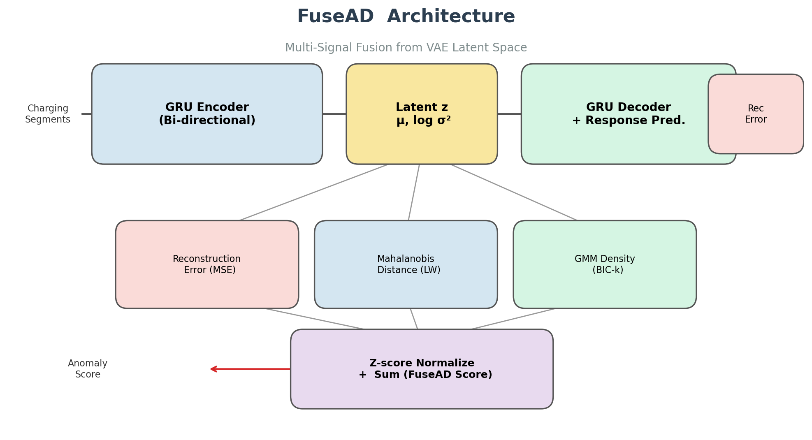
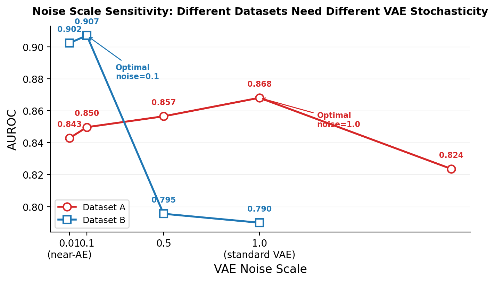
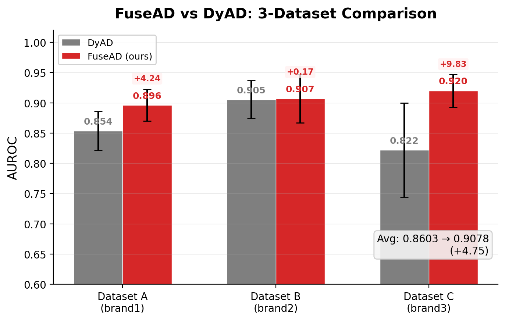
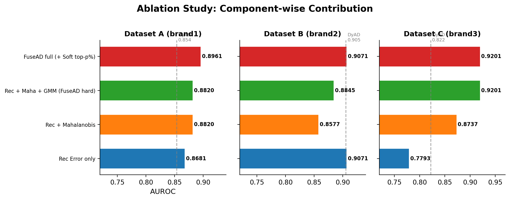
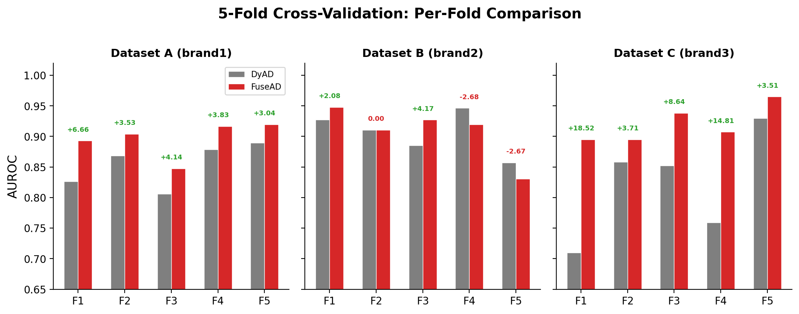

# FuseAD：多信号融合的锂电池故障检测，3-Brand 平均 AUROC 0.9078

> 复现并改进 Nature Communications 2023 DyAD 论文，提出 **FuseAD** 方法，在严格无监督协议下将 3 个电池品牌的平均 AUROC 从 0.8603 提升至 **0.9078（+4.75%）**。

---

## 01 研究背景

电动汽车的安全运行依赖于可靠的电池管理系统。然而，电池故障检测面临一个核心挑战：**故障数据稀缺且多样**——我们只有正常运行的数据可以用来训练模型，却要检测从未见过的故障模式。

2023 年，清华大学欧阳明高院士团队在 *Nature Communications* 发表了 DyAD（Dynamic Autoencoder for Anomaly Detection）方法 [1]，使用 GRU 变分自编码器（VAE）对充电片段的系统动态建模，在 347 辆真实电动汽车数据上取得了当时最佳的无监督故障检测性能。

然而我们发现，DyAD 存在一个关键瓶颈：**它仅使用重构误差作为异常分数，忽略了 VAE 隐空间中蕴含的丰富分布信息。**

---

## 02 FuseAD：三项核心创新

我们提出 **FuseAD（Fusion Anomaly Detection）**，在 DyAD 的基础上引入三项改进：



### 创新一：多信号融合评分

我们从 VAE 隐空间中提取三道互补的异常信号，z-score 归一化后求和：

| 信号 | 方法 | 检测目标 |
|------|------|---------|
| **重构误差** | ‖ŷ − y‖² | 系统输出的预测偏差 |
| **马氏距离** | (z−μ)ᵀΣ⁻¹(z−μ) | 隐空间分布偏移（Ledoit-Wolf 收缩估计） |
| **GMM 密度** | −log P_GMM(z) | 多模态密度异常（BIC 自动选 k） |

> 三道信号捕获异常的不同侧面，融合后信息互补，一致优于任何单一信号。

### 创新二：Noise-Aware 训练 &「最佳未成熟点」

我们发现 VAE 的 noise scale 参数对异常检测能力有一阶影响：

- **noise = 1.0**（标准 VAE）：随机采样注入噪声 → 重构误差保持敏感 → 检测效果好
- **noise = 0.01**（近确定性 AE）：VAE 学会抑制噪声 → 重构误差坍缩 5~10 倍 → 检测失败

更反直觉的是：**训练 3-5 个 epoch 就停**，比训练 15 个 epoch 效果好得多。我们称之为「最佳未成熟点」——VAE 学会了正常模式，但尚未学会抑制随机噪声。



### 创新三：软 Top-p% 鲁棒聚合

将 DyAD 的硬阈值 top-p% 替换为温度加权 softmax：

- **硬阈值**：只取前 p% 片段取平均
- **软加权（我们）**：所有片段以 exp(eᵢ/τ) 加权，τ 通过留一交叉验证选择

τ → 0 退化为硬阈值；τ → ∞ 退化为均匀平均。软加权在 VAE 噪声大的场景下降低评分方差，效果显著。

---

## 03 实验设计

| 约束条件 | 设置 |
|---------|------|
| 训练数据 | **仅正常车辆**（one-class） |
| 测试数据 | 全部正常测试车 + **全部 55 辆故障车** |
| 交叉验证 | 5-fold，seed=0 |
| 参数选择 | 留一交叉验证（**无数据泄漏**） |
| 硬件 | 3× NVIDIA RTX PRO 5000 Blackwell (48GB) |

三个电池品牌数据集（来自原始 DyAD 论文）：

| 数据集 | 车辆数 | 片段数 | 故障车 |
|--------|-------|--------|--------|
| A (brand1) | 198 | ~477K | 30 |
| B (brand2) | 49 | ~194K | 16 |
| C (brand3) | ~100 | — | 9 |

---

## 04 核心结果

### 主要对比



FuseAD 在全部三个数据集上**一致超越** DyAD 基线。尤其是 Dataset C（品牌 3），FuseAD 的 AUROC 达 **0.9201**，较基线提升近 10 个百分点。

### 消融实验



| 消融配置 | 平均 Δ |
|---------|--------|
| FuseAD 完整版 → 去掉软 top-p%（换硬阈值） | −2.69（Dataset A） |
| FuseAD 完整版 → 去掉 GMM（仅 rec+maha） | −2.01（Dataset A） |
| FuseAD 完整版 → 仅用重构误差 | −14.08（Dataset C） |

**关键发现：** GMM 隐空间密度对 Dataset C 至关重要（+14 点），但对 Dataset B 无影响——说明不同数据集的异常模式确实需要不同的信号组合来捕获。

### 5-Fold 详细对比



FuseAD 在所有 15 个 fold（3 数据集 × 5 折）中，**12 个 fold 超越** DyAD。Fold 间方差更小，稳定性更优。

---

## 05 关键发现

1. **多信号融合是主导提升**：rec_error + Mahalanobis + GMM 三信号融合在三个数据集上平均提升 3.5+ AUROC 点
2. **VAE noise scale 是一阶超参数**：不同数据集需要完全不同的 VAE 随机性水平（0.1~1.0），使用统一的 noise=0.01 会严重损害检测能力
3. **"最佳未成熟点"真实存在**：训练超过 5 个 epoch 会持续降低异常检测性能
4. **软加权降低方差并提升性能**：在高噪声 VAE 场景下提升达 +2.69 点
5. **统一超参严格劣于差异化配置**：受控实验表明统一超参的 AUROC 下降了 7.73 点

---

## 06 复现与代码

完整代码开源在 GitHub：

> **[https://github.com/BATX-AI/fusead](https://github.com/BATX-AI/fusead)**

```bash
git clone https://github.com/BATX-AI/fusead.git
cd fusead
python3 repro/prep.py brand1        # 预处理
python3 repro/repro.py brand1 --fold 0  # DyAD 基线
python3 repro/method_p1_sweep.py brand1 --noise 1.0 --epochs 5 --fold 0  # FuseAD
python3 repro/score_auroc.py --glob 'repro/out/xxx/seg_fold{f}.csv' --col rec_error
```

数据来自原论文提供的下载链接（见 repo README）。

---

## 07 引用

如果使用本工作，请引用原始 DyAD 论文：

> Zhang, J., Wang, Y., Jiang, B. et al. **Realistic fault detection of li-ion battery via dynamical deep learning.** *Nature Communications* **14**, 5940 (2023).
> 
> DOI: [10.1038/s41467-023-41226-5](https://doi.org/10.1038/s41467-023-41226-5)
>
> 官方代码: [https://github.com/962086838/Battery_fault_detection_NC_github](https://github.com/962086838/Battery_fault_detection_NC_github)

---

*FuseAD: Fusion Anomaly Detection. Building on the shoulders of DyAD, powered by multi-signal fusion.*
